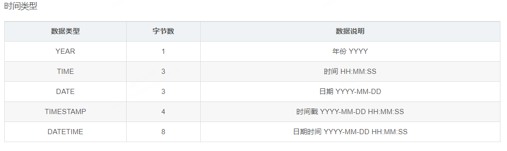

# 数据库
```text
DataBase，简称DB
存储数据的仓库，数据是有组织的进行存储
```
# 数据库管理系统
```text
DataBase Management System 简称DBMS
管理数据库的大型软件。如：Oracle、MySQL、SQL Server
```
# SQL
```text
Structured Query Language，简称SQL，结构化查询语言
操作关系型数据库的编程语言
定义操作所有关系型数据库的统一标准
```
# MySQL数据模型
```text
关系型数据库是建立在关系模型基础上的数据库，简单说，关系型数据库是由多张能相互连接的二维表组成的数据库
优点：
1、都是使用表结构，格式一致，易于维护
2、使用通用的SQL语言操作，使用方便，可用于复杂查询
3、数据存储在磁盘中，安全
```
# SQL分类
```text
DDL(Data Definition Language)数据定义语言，用来定义数据库对象:数据库，表，列等

DML(Data Manipulation Language)数据操作语言，用来对数据库中表的数据进行增删改

DQL(Data Query Language)数据查询语言，用来查询数据库中表的记录(数据)

DCL(Data Control Language)数据控制语言，用来定义数据库的访问权限和安全级别，及创建用户
```
# 操作数据库
```sql
-- 创建数据库
create database [if not exists] 库名;
-- 查看数据库
show databases;
-- 删除数据库
drop database [if exists] 库名;
-- 使用数据库
use 库名;
-- 查看当前使用的数据库
select database();
```
 # 操作表
```sql
-- 查看表
show tables;
-- 创建表
create table [if not exists] 表名 (
    字段名1 数据类型1,
    字段名2 数据类型2,
    ...
    字段名n 数据类型n                
)
create table student(
    id int,
    name varchar(10), 
    gender char(1), 
    birthday date,
    score double(5,2), 
    email varchar(64), 
    tel varchar(15), 
    status tinyint
);
-- 查看表结构
desc 表名;
-- 查看建表语句
show create table 表名 \G
-- 修改表名
alter table 表名 rename to 新的表名;
-- 添加列
alter table 表名 add 列名 数据类型;
-- 指定字段后添加列
alter table 表名 add 列名 数据类型 after 指定字段名;
-- 修改数据类型
alter table 表名 modify 列名 新的数据类型;
-- 修改列名以及数据类型
alter table 表名 change 列名 新列名 新的数据类型;
-- 删除列
alter table 表名 drop 列名;
-- 删除表
drop table [if exists] 表名;
```
# 数据类型




# 数据操作 DML
```sql
-- 给指定列名添加数据
insert into 表名(列名1,列名2,...) values(值1,值2,...);
-- 给所有列添加数据
insert into 表名 values(值1,值2,...);
-- 批量添加    
insert into 表名 values(值1,值2,...),(值1,值2,...),...;
-- 修改数据
update 表名 set 列名1=值1,列名2=值2,... [where 条件];
-- 删除数据
delete from 表名 [where 条件];
```
# 查询语法 DQL
语法结构
```sql
select 
    字段列表
from 
    表名列表
where 
    条件列表
group by 
    分组字段
having 
    分组后条件
order by 
    排序列表
limit 
    分页限定
```
基础查询
```sql
-- 查询所有列
select * from stu;
-- 查询去除重复的记录
select distinct address from stu;
-- 起别名 as，可省略
select name, math as 数学成绩, english 英语成绩 from stu;
```
条件查询
```sql
-- 查询年龄在20~30之间的学生
select * from stu where age >= 20 and age <= 30;
select * from stu where age between 20 and 30;
-- 查询入学日期在'1998-09-01'到'1999-09-01'之间的学生
select * from stu where hire_date between '1998-09-01' and '1999-09-01';
-- 用in代替or查询 
select * from stu where age in (18, 20, 22);
-- null值：is null; is not null
select * from stu where english is null;
-- 模糊查询。_：匹配单个字符，%：匹配任意个字符
select * from stu where name like '马%';
```
排序查询
```sql
select * from stu order by math desc, english asc;
```
分组查询
```sql
-- 聚合函数：count()、max()、min()、sum()、avg()。
-- 聚合函数不会计算null值
-- 男女同学各自的数学平均分
select sex, avg(math) from stu group by sex;
-- 男女同学各自的数学平均分以及人数    
select sex, avg(math), count(*) from stu group by sex;
-- 男女同学数学大于70分的平均分
select sex, avg(math), count(*) from stu where math >= 70 group by sex;
-- 分组后人数大于2的
select sex, avg(math), count(*) from stu where math >= 70 group by sex having count(*) > 2;
```
分页查询
```sql
select * from stu limit 起始索引, 查询条目数;
-- 查询第i页，每页显示j条数据
select * from stu limit (i-1) * j, j;
```


