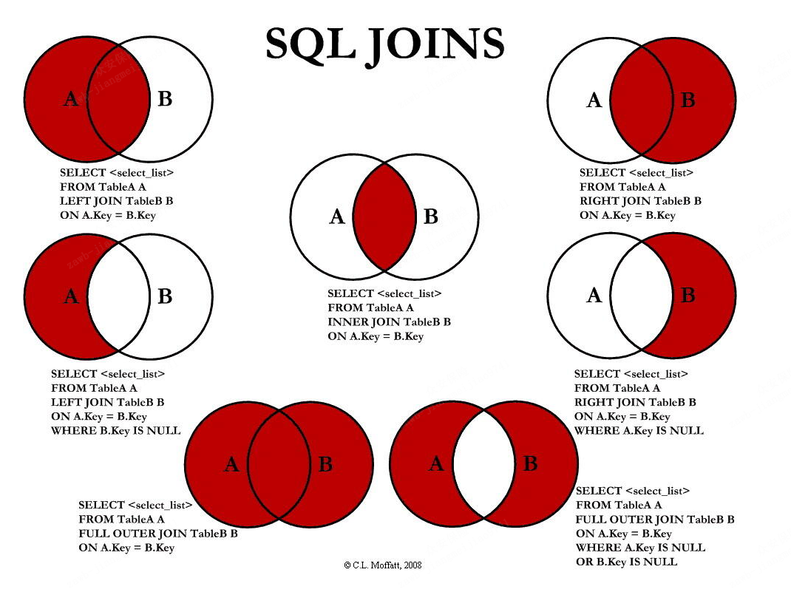

# 约束
概念
```text
约束是作用于表中列上的规则，用于限制加入表的数据
约束的存在保证了数据库中数据的正确性、有效性和完整性
```
分类
```text
非空约束(NOT NULL)：保证列中所有数据不能有null值
唯一约束(UNIQUE)：保证列中所有数据各不相同
主键约束(PRIMARY KEY)：主键是一行数据的唯一标识，要求非空且唯一
检查约束(CHECK)：保证列中的值满足某一条件
默认约束(DEFAULT)：保存数据时，未指定值则采用默认值
外键约束(FOREIGN KEY)：外键用来让两个表的数据之间建立连接，保证数据的一致性和完整性

MySQL不支持检查约束
```
```sql
create table emp(
    id int primary key auto_increment,
    ename varchar(50) not null unique,
    joindate date not null,
    salary double(7,2) not null,
    bonus double(7,2) default 0
);

insert into emp(id, ename, joindate, salary, bonus) values (1,'张三','1999-11-11',8800,5000); -- ok
-- 主键约束
insert into emp(id, ename, joindate, salary, bonus) values (null,'张三','1999-11-11',8800,5000);
insert into emp(id, ename, joindate, salary, bonus) values (1,'张三','1999-11-11',8800,5000);
insert into emp(id, ename, joindate, salary, bonus) values (2,'李四','1999-11-11',8800,5000); -- ok
-- 非空约束
insert into emp(id, ename, joindate, salary, bonus) values (3,null,'1999-11-11',8800,5000);
insert into emp(id, ename, joindate, salary, bonus) values (3,'李四','1999-11-11',8800,5000);
-- 默认约束
insert into emp(id, ename, joindate, salary) values (3,'王五','1999-11-11',8800); -- ok bonus=0
insert into emp(id, ename, joindate, salary, bonus) values (3,'王五','1999-11-11',8800, null ); -- bonus=null
-- auto_increment
insert into emp(ename, joindate, salary, bonus) values ('张三','1999-11-11',8800, null );
insert into emp(id, ename, joindate, salary, bonus) values (null,'李四','1999-11-11',8800, null );
```
外键约束
```text
外键在从表，外键对应的是主表的主键
先创建主表，再创建从表；先删从表再删主表
```
# 表设计
```text
一对一
一对多
多对多
```
# 多表查询
内连接
```text
--隐式内连接
SELECT 字段列表 FROM 表1,表2... WHERE 条件;

-- 显示内连接
SELECT 字段列表 FROM 表1 [INNER] JOIN 表2 ON 条件;
```
外连接
```text
左外连接
SELECT 字段列表 FROM 表1 LEFT [OUTER] JOIN 表2 ON 条件;

-- 右外连接
SELECT 字段列表 FROM 表1 RIGHT [OUTER] JOIN 表2 ON 条件;
```

# 子查询
```text
查询中嵌套查询，称嵌套查询为子查询

单行单列:作为条件值，使用=!=><等进行条件判断
SELECT 字段列表 FROM 表 WHERE 字段名 =(子查询);

多行单列:作为条件值，使用in等关键字进行条件判断
SELECT 字段列表 FROM 表 WHERE 字段名 in(子查询);

多行多列:作为虚拟表
SELECT 字段列表 FROM(子查询)WHERE 条件;
```
# 事务
```text
begin：开启事务
commit：提交事务
rollback：回滚事务
```
四大特性
```text
原子性(Atomicity):事务是不可分割的最小操作单位，要么同时成功，要么同时失败
一致性(Consistency):事务完成时，必须使所有的数据都保持一致状态。 
隔离性(Isolation):多个事务之间，操作的可见性
持久性(Durability):事务一旦提交或回滚，它对数据库中的数据的改变就是永久的
```
```text
查看当前是否自动提交事务
select @@autocommit; //1自动提交，0取消自动提交
```